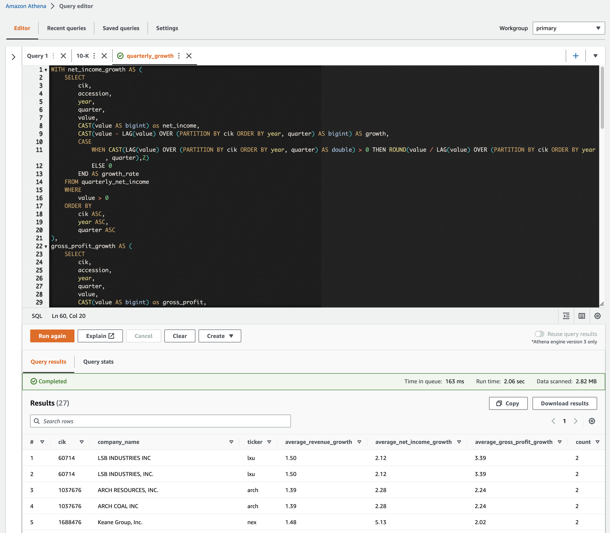
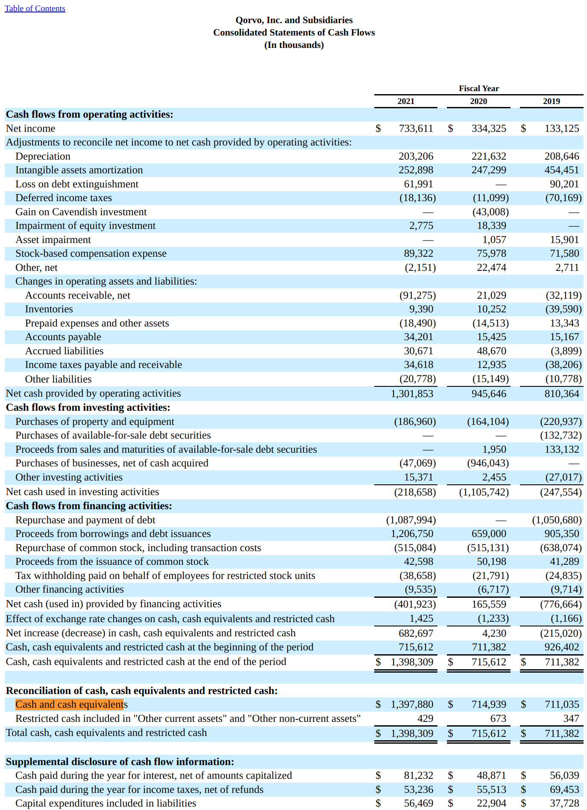

# Objective

Download and analyze all the financial reports of the publicly traded US companies. For example, listing the companies 
whose revenue, net income, and gross profit have constantly increased throughout year 2022.



## Background

It is requirement by SEC (US Security and Exchange Commission) to submit the quarterly and annual financial reports by the
publicly traded US companies. They are all available in [SEC EDGAR](https://www.sec.gov/edgar).


---

# Financial report

## Types of report forms

1. 10-K : Annual report
2. 10-Q : Quarterly report




---
# Execution overview


## Master index file

An index file is an CSV where each row identifies ```(CIK, Report form type, date, path)```.

```
<YYYY>/<QTR>/xbrl.gz in https://www.sec.gov/Archives/edgar/full-index" is
the master index file for the filings in XML format at each YYYY/QTR.
+-- <YYYY>
    +-- <QTR>
        +-- xbrl.gz

The master index file is a CSV with the format:
|CIK    |Company Name|Form Type|Filing Date|TXT Path                                   |
|-------|------------|---------|-----------|-------------------------------------------|
|1002047|NetApp, Inc.|10-Q     |2020-02-18 |edgar/data/1002047/0001564590-20-005025.txt|
```
Each row points to the TXT file which is all-in-one file for the filing where
each document is segmented with <DOCUMENT> tag. However, it is not easy to
parse the TXT to extract each financial statement (FS).

## 1. sec_edgar_download_xbrl_indices.sh

```sec_edgar_download_xbrl_indices.sh``` downloads the master index files for filings in the XBRL format. 
Each file is for a specific ```YYYY/QTR``` and each row in a file refers to a filing in XBRL format.
The result is ```DIR_DATA_CSV_INDEX/<YYYY>QTR<QTR>``` CSV files that have the format below.

| CIK     | Company Name           | Form Type | Date Filed | Filename                                    |
|---------|------------------------|-----------|------------|---------------------------------------------|
| 1000045 | NICHOLAS FINANCIAL INC | 10-Q      | 2022-02-09 | edgar/data/1000045/0000950170-22-000940.txt |
| 1000045 | NICHOLAS FINANCIAL INC | 8-K       | 2022-01-13 | edgar/data/1000045/0000950170-22-000296.txt |
| 1000045 | NICHOLAS FINANCIAL INC | 8-K       | 2022-01-31 | edgar/data/1000045/0000950170-22-000568.txt |

## 2. sec_edgar_list_xbrl_xml.py

```sec_edgar_list_xbrl_xml.py``` goes through the master index file ```DIR_DATA_CSV_INDEX/<YYYY>QTR<QTR>``` 
for each ```YEAR/QTR``` to generate the URLs to the XBRL XML files of SEC filings.
The result is ```DIR_DATA_CSV_LIST/<YYYY>QTR<QTR>_LIST.gz``` for each ```YEAR/QTR``` where DIR_DATA_CSV_LIST 
= ```csv/listing``` that have the format below.

| CIK     | Company Name             | Form Type | Date Filed | Filename                                                                                   |
|---------|--------------------------|-----------|------------|--------------------------------------------------------------------------------------------|
| 1000045 | NICHOLAS FINANCIAL INC   | 10-Q      | 2022-02-09 | https://sec.gov/Archives/edgar/data/1000045/000095017022000940/nick-20211231_htm.xml       |
| 1000209 | MEDALLION FINANCIAL CORP | 10-K      | 2022-03-14 | https://sec.gov/Archives/edgar/data/1000209/000095017022003603/mfin-20211231_htm.xml       |
| 1000228 | HENRY SCHEIN INC         | 10-K      | 2022-02-15 | https://sec.gov/Archives/edgar/data/1000228/000100022822000016/hsicform10k20211225_htm.xml |

## 3. sec_edgar_download_xbrl_xml.py
sec_edgar_download_xbrl_xml.py iterates through csv/listing/<YYYY>QTR<QTR>_LIST.gz and download XBRL XML 
filing for CIK/ACCESSION. CIK/ACCESSION identifies the filing e.g. 10K for a specific YEAR or 10Q for a 
specific YEAR/QTR of a company. 

The results are:

* 3-1: ```DIR_DATA_CSV_XBRL/<YYYY>QTR<QTR>_XBRL.gz``` where DIR_DATA_CSV_XBRL=csv/xbrl/.
* 3-2: ```DIR_DATA_XML_XBRL/<CIK>/<ACCESSION>/<XBRL>.gz``` where DIR_DATA_XML_XBRL=xml/xbrl/.

The format of ```<YYYY>QTR<QTR>_XBRL.csv``` in DIR_DATA_CSV_XBRL:

| CIK     | Company Name             | Form Type | Date Filed | Year | Quarter | Filename                                                                         | Filepath                                        |
|---------|--------------------------|-----------|------------|------|---------|----------------------------------------------------------------------------------|-------------------------------------------------|
| 1000045 | NICHOLAS FINANCIAL INC   | 10-K      | 2019-06-28 | 2019 | 2       | https://sec.gov/Archives/edgar/data/1000045/000156459019023956/nick-20190331.xml | 1000045/000156459019023956/nick-20190331.xml.gz |
| 1000209 | MEDALLION FINANCIAL CORP | 10-Q      | 2019-05-10 | 2019 | 2       | https://sec.gov/Archives/edgar/data/1000209/000119312519144225/mfin-20190331.xml | 1000209/000119312519144225/mfin-20190331.xml.gz |
| 1000228 | HENRY SCHEIN INC         | 10-Q      | 2019-05-07 | 2019 | 2       | https://sec.gov/Archives/edgar/data/1000228/000100022819000030/hsic-20190330.xml | 1000228/000100022819000030/hsic-20190330.xml.gz |

## 4. sec_edgar_parse_xbrl_xml.py

```sec_edgar_parse_xbrl_xml.py``` parse each XBRL XML file and generate a CSV file for the financial statement 
for ```/<CIK>/<ACCESSION>``` SEC filing of the companies.

---

# Execution steps (Local)

## Process single quarter
```
YEAR=2022
QTR=1

sec_edgar_download_xbrl_indices.sh ${YEAR}
python3 sec_edgar_list_xbrl_xml.py     -y ${YEAR} -q ${QTR}
python3 sec_edgar_download_xbrl_xml.py -y ${YEAR} -q ${QTR}
python3 sec_edgar_parse_xbrl_xml.py    -y ${YEAR} -q ${QTR}
```

## Upload to AWS S3

```
aws s3 sync ../data/ $S3_URL
```

---

# Execution steps (AWS)

1. Glue Crawler parses uploaded CSV files and generate Glue catalog database.
2. Build queries in Athena to analyze the database.
